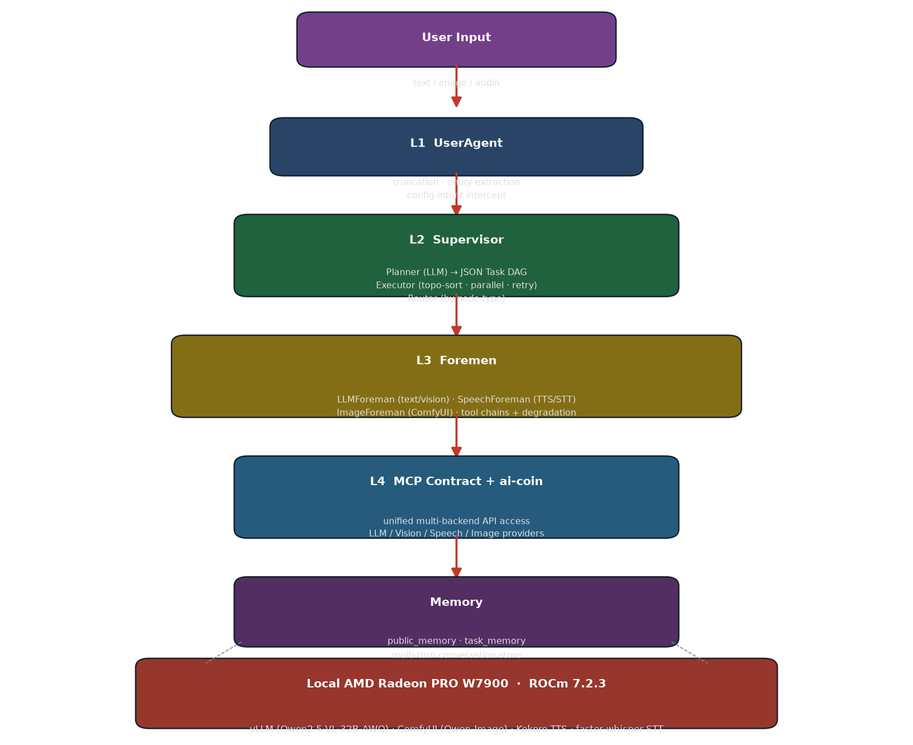

# Super Desktop Assistant — Project Specification

**Track 2: Development & Local Deployment of Private AI Agents**
**AMD AI DevMaster Radeon GPU Hackathon 2026-07**

---

## 1. Application Scenarios

Super Desktop Assistant is a **local-first, multi-model intelligent scheduling system**. Users interact through a single chat interface (CLI / Web / desktop window) using **text or voice**, and the system automatically orchestrates multiple AI models to complete complex tasks.

Typical scenarios:

| Scenario | Example Command | Orchestration |
|---|---|---|
| **Text generation** | "Write a five-character quatrain about autumn" | Planner → LLM node |
| **Vision analysis** | "Analyze this error screenshot and explain the cause" | Vision node → LLM |
| **Voice control** | "Wake word: draw a cyberpunk cat with transparent background" | STT → Planner → image_gen |
| **Image generation** | "Draw an anime girl with silver hair" | Planner → LLM prompt → ComfyUI image_gen |
| **Voice broadcast** | "Read this paragraph aloud" | TTS node |
| **File/agent tools** | "Search this codebase for the bug and fix it" | LLM with 8 tools (read/write/search) |

**Target users**: developers and power users who need a **private, offline-capable AI assistant** on their own AMD GPU workstation — no data leaves the machine, no cloud API dependency.

---

## 2. Agent Architecture Diagram



```
User input (text / image / audio)
  │
  ▼
┌─ [L1] UserAgent ──────────────────────────────────────┐
│  Conversation truncation · entity extraction ·         │
│  injection filtering · config-intent intercept         │
└────────────────────────┬──────────────────────────────┘
                         ▼
┌─ [L2] Supervisor ─────────────────────────────────────┐
│  Planner    LLM generates JSON task DAG               │
│  Executor   topo-sort + parallel + timeout/retry      │
│  Router     route nodes to Layer-3 foremen            │
└──────┬───────────────┬───────────────┬───────────────┘
       │ text/vision   │ audio         │ image
       ▼               ▼               ▼
┌─ [L3] Foremen ────────────────────────────────────────┐
│  LLMForeman   8-tool chain + function calling         │
│  SpeechForeman TTS/STT with degradation chain         │
│  ImageForeman  API → SD-WebUI → ComfyUI fallback      │
└──────┬───────────────┬───────────────┬───────────────┘
       ▼               ▼               ▼
┌─ [L4] MCP contract + multi-backend API ──────────────┐
│  ai-coin unified AI access layer                      │
│  (providers / tool loop / structured output / retry)  │
└────────────────────────┬──────────────────────────────┘
                         ▼
┌─ [Memory] public_memory + task_memory ───────────────┐
│  cross-task snapshots · task slot · global notes       │
└──────────────────────────────────────────────────────┘
```

**Core flow**: the Planner (powered by a local multimodal LLM) decomposes a natural-language request into a **structured JSON task DAG** (nodes + dependencies). The Executor topologically sorts and runs nodes **in parallel** where possible, injects upstream outputs downstream, and propagates failures (upstream failure → downstream SKIPPED). The Router dispatches nodes to domain foremen by type (`llm / vision / image_gen / tts / stt`).

---

## 3. Core Capabilities

| Capability | Description |
|---|---|
| 💬 **LLM reasoning** | Q&A, writing, translation, code generation (up to 8 tool-call rounds) |
| 👁️ **Vision analysis** | Image recognition, screenshot analysis, analyzing agent-generated images |
| 🎤 **STT** | Speech-to-text (OpenAI-compatible → local faster-whisper) |
| 🔊 **TTS** | Text-to-speech (OpenAI-compatible → edge-tts → local HTTP) |
| 🎨 **Image generation** | ComfyUI (Qwen-Image) with 3-tier degradation (API → SD-WebUI → ComfyUI) |
| 🔧 **Agent tools** | Function calling: read/write/search files, generate images, shared memory |
| 🔀 **Multi-model scheduling** | Multi-provider parallel scheduling, capability routing, local-first preference |
| 💬 **Config via dialog** | Layer-1 has sole config permission; adjust models/params/paths naturally in chat |

**Agent tools** (8 total): `get_shared_memory`, `read_file` (PDF-aware), `write_file`, `search_code`, `list_files`, `generate_image`, `add_note`, `add_discovery`.

---

## 3.1 Key Design Innovations — *Rewrite → Activate → Maximize*

The system is built around three design principles that make it dramatically more effective than a plain single-model chatbot on the same GPU:

### 1) Real-time prompt rewriting
Before every DAG node executes, the system **rewrites the prompt** for that node:
- The **Planner** turns a plain request into a structured, domain-aware task prompt.
- A dedicated **prompt builder** converts simple instructions into **expert-grade labels** — e.g. *"draw a silver-haired girl"* → `anime girl, silver long hair, very awa, masterpiece, best quality, highres`.
- The **Executor** further adjusts long-context prompts **at runtime** from upstream node results (`runtime_allocator`), so each model always receives the most informative input.

This lets a 32B local LLM and a local image model punch far above their weight — the "smartness" is partly in the rewriting.

### 2) Expert activation
Instead of one model doing everything, each task **activates the best-fitting local expert**:
- LLM / Vision → vLLM (Qwen2.5-VL-32B)
- Speech → Kokoro TTS + faster-whisper STT
- Image → ComfyUI (Qwen-Image)

A domain **foreman** wraps each expert with its own tool chain and graceful degradation, and multiple experts run **in parallel** where the DAG allows — text, vision, speech and image can be produced from a single command.

### 3) Maximize local AI utilization
- **Local-first routing**: every model is served locally on the AMD GPU; cloud is never required for core functions.
- **DAG parallelism**: independent nodes execute concurrently, keeping the GPU saturated.
- **ROCm optimization**: vLLM tuned for RDNA3 (**+11% generation**, **+109% long-context prefill**), ComfyUI with MIOpen/SDPA — the local GPU is used to its fullest, and the whole assistant stays responsive and private.

---

## 4. Model Introduction & Local Deployment Plan

All models are **locally deployed on AMD Radeon PRO W7900** (48 GB, ROCm 7.2.3). No cloud APIs.

| Role | Model | Framework | Size | Port |
|---|---|---|---|---|
| LLM + Vision | **Qwen2.5-VL-32B-Instruct-AWQ** | vLLM (ROCm) | 20.7 GB weights | 8000 |
| TTS | **Kokoro-82M** (zh) | ONNX/PyTorch CPU | 82M params | 8766 |
| STT | **faster-whisper-medium** | CTranslate2 CPU int8 | ~1.5 GB | 8766 |
| Image gen | **MiaoMiao Anima v1.1** (Qwen-Image DiT) | ComfyUI | 3.99 GB | 8188 |

### Memory planning (48 GB VRAM)
```
vLLM resident (Qwen2.5-VL-32B-AWQ):
  weights 20.7G + vision tower ~2G + 36k KV cache ~9G ≈ 32 GB   (gpu_memory_utilization=0.72)
ComfyUI on-demand (image gen):  ~8 GB
Speech (TTS/STT): pure CPU, no GPU
```
LLM+vision and image generation coexist comfortably (32 + 8 = 40 GB < 48 GB).

### Unified AI access with ai-coin
All LLM/vision calls go through **ai-coin** — a pluggable AI access layer (SQLite-backed) that manages providers, models, tool loops, structured output, and retries. The speech adapters were extended with `tts()`/`stt()` methods for the OpenAI-compatible audio endpoints.

---

## 5. Optimization for AMD Radeon GPU / ROCm

> Full details & benchmark methodology: [`ROCm_Optimization.md`](./ROCm_Optimization.md)

### Hardware-aware analysis (W7900 / gfx1100 / RDNA3)
- **No native FP8** on RDNA3. FP16/BF16 WMMA = 123 TFLOPS, INT4 = 245 TOPS.
- **Decode (M=1) cannot use WMMA** — single token wastes 15/16 of a 16×16 tile; decode is bandwidth-bound (~54 tok/s theoretical for 32B INT4).

### Optimizations applied (vLLM source-level)
| # | Optimization | Implementation | Result |
|---|---|---|---|
| 1 | **bfloat16 fix** | patched `awq_triton.py` accumulator to `tl.float32` (ROCm Triton rejects bf16 `tl.dot` out_dtype) | fixed crash |
| 2 | **AWQ block size** | `block_size_n 32→128`, `block_size_k 32→64` (for large N = 27648) | +10% |
| 3 | **FP16 matmul path** (build-specific) | `VLLM_BATCH_INVARIANT=true` on the original vLLM build; **omit on build `0.23.1rc1.dev411.rocm723`** — default INT4 path already reaches 13.7 tok/s | **+11% gen, +109% prefill** |

### Measured benchmarks
| Metric | Baseline | Optimized | Gain |
|---|---|---|---|
| Text generation (300 tok) | 12.3 tok/s | **13.7 tok/s** | +11% |
| Long-context 16k prefill | 7.95 s | **3.80 s** | **+109%** |
| Vision analysis (1 image) | 2.7–3.1 s | 2.85–3.5 s | — |

Failed experiments recorded: CUDAGraph (slower on ROCm), dtype fp16 (no gain). Version note: `VLLM_BATCH_INVARIANT` is **harmful on the current vLLM build** (`0.23.1rc1.dev411.rocm723`), where it drops decode to 3.8 tok/s — the default INT4 path reaches 13.7 tok/s without it (see `ROCm_Optimization.md` §4).

### End-to-end performance
- Full DAG orchestration (planner → executor → foremen): **18–45 s** depending on task type.
- Text generation stable at **13.7 tok/s** on a single W7900.

---

## 6. Deliverables Summary

| Requirement | Status | Location |
|---|---|---|
| Project Specification | ✅ This document | `docs/Project_Specification.md` |
| ROCm optimization report | ✅ | `docs/ROCm_Optimization.md` |
| Source code + README | ✅ | `source/super-desktop-assistant/` |
| Demo video script | ✅ | `demo/DEMO_SCRIPT.md` |
| PPT/Poster | 🚧 In preparation | `presentation/` |
